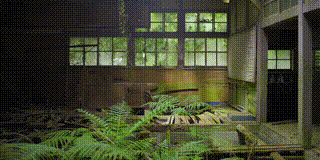

# DeepVidSumm

A modular video summarization and question-answering pipeline that uses vision-language models to identify relevant segments in long videos and produces concise answer clips.

## Features

- **Vision-Language Analysis**: Uses multimodal models to understand video content and identify answer-relevant time ranges
- **Automatic Frame Extraction**: FFmpeg-based preprocessing with optional GPU acceleration
- **Video Composition**: Cuts and stitches relevant segments into cohesive answer clips
- **Gradio Web Interface**: User-friendly UI for uploading videos and entering prompts
- **Video Inbetweening (LoRA)**: Custom Wan2.2 & LongCat LoRA training for video frame interpolation/generation

## Demo Videos

### 1. Video Query

| Input | Prompt | Answer |
|-------|--------|--------|
|  | Find all the scoring goal scenes |  |
|  | Find all the scenes with trains |  |

### 2. Video Transition Generation

| Original Video | Generated Video |
|----------------|-----------------|
|  |  |
|  |  |


## Project Structure

```
deepvidsumm/
├── main.py                     # Entry point for the Gradio demo
├── pyproject.toml              # Project dependencies and workspace config
├── app/                        # Core application modules
│   ├── models.py               # Data models (TimeRange, PreprocessResult)
│   ├── analyzer/               # Vision-language model integration
│   │   └── openrouter_analyzer.py  # OpenRouter API caller for time range extraction
│   ├── composer/               # Video cutting and stitching
│   │   └── ffmpeg_composer.py  # FFmpeg-based segment composition
│   ├── gui/                    # User interface
│   │   └── gradio_gui.py       # Gradio web interface
│   ├── pipeline/               # Orchestration
│   │   └── simple_pipeline.py  # Preprocessing → Analysis → Composition flow
│   └── preprocessor/           # Frame extraction
│       └── frame_preprocessor.py  # FFmpeg/ffprobe frame extraction
├── wan-vid-inbetween/          # Video inbetweening training (Wan2.2 LoRA)
│   ├── src/
│   │   ├── train_lora_inbetween.py        # LoRA training script
│   │   ├── train_bidirectional_inbetween.py  # Bidirectional inbetweening
│   │   ├── inference.py                    # Inference utilities
│   │   ├── dataset.py                      # Video dataset loader
│   │   └── trainer.py                      # Training loop implementation
│   └── config/                 # Training configurations
│       ├── default_inbetween_config.yaml
│       ├── bidirectional_inbetween_config.yaml
│       └── fast_inbetween_config.yaml
├── evaluation/                 # Evaluation scripts
│   ├── ffmpeg_eval.py          # SSIM, PSNR, VMAF metrics via FFmpeg
│   └── vbench_eval.py          # VBench evaluation for generated videos
├── dep/                        # Dependencies and datasets
│   ├── clipshots/              # ClipShots dataset annotations
│   └── diffsynth/              # DiffSynth library
└── runs/                       # Output directory for sessions
```

## Installation

1. **Install dependencies with uv**:
   ```bash
   uv sync
   # or
   uv pip install -e .
   ```

2. **Set environment variables**:
   ```bash
   export OPENROUTER_API_KEY="your-api-key"
   ```

## Usage

### Gradio Demo

Launch the web interface:
```bash
uv run python main.py
```

Then open the Gradio link (default: `http://localhost:7860`) in your browser.

1. Upload a video (MP4 recommended)
2. Enter a prompt (e.g., "When does the speaker discuss machine learning?")
3. Click "Generate short clip"
4. The answer clip is saved under `runs/session_*/answer.mp4`

### Wan Video Inbetweening Training

Train a LoRA adapter for video inbetweening on the Wan2.2 model:

```bash
cd wan-vid-inbetween
python src/train_lora_inbetween.py --config config/default_inbetween_config.yaml
```

Resume from a checkpoint:
```bash
python src/train_lora_inbetween.py --config config/default_inbetween_config.yaml --resume latest
```

The saved weights are stored in wan-vid-inbetween/output/bidirectional_inbetween_lora.

### LongCat Video Inbetweening (DiffSynth)

The `dep/diffsynth` directory contains a modified version of DiffSynth-Studio with added support for LongCat video inbetweening.

To train the LongCat inbetweening model:

```bash
cd dep/diffsynth
./LongCat-Video-InBetween.sh
```

Key modifications include:
- **Training Script**: `examples/wanvideo/model_training/train_inbetween.py` implements the training logic for inbetweening, conditioning on start and end frames.
- **Shell Script**: `LongCat-Video-InBetween.sh` provides a configured entry point for training with `accelerate`.

The saved weights are stored in dep/diffsynth/models/train/LongCat-Video-InBetween_lora.

### Evaluation

Evaluate generated videos using SSIM, PSNR, and VMAF:
```bash
python evaluation/ffmpeg_eval.py --original-dir /path/to/originals --generated-dir /path/to/generated
```

## Pipeline Flow

1. **Preprocessing**: Extract frames from the input video at a target FPS (default: 2 FPS) using FFmpeg
2. **Analysis**: Send frames to a vision-language model (via OpenRouter) with the user prompt to identify relevant time ranges
3. **Composition**: Cut the identified segments from the original video and stitch them together
4. **Output**: Return the composed answer clip

## Configuration

### FFmpeg Acceleration

The pipeline supports GPU-accelerated frame extraction and encoding:

- **Preprocessor**: Configure `hwaccel`, `decoder`, `hw_output_format` in `FramePreprocessor`
- **Composer**: Configure `hwaccel`, `decoder`, `encoder` in `FFMpegComposer`

CPU fallback is automatic if GPU encoding fails.

### Analyzer Settings

- `max_frames`: Maximum frames to send to the vision model (default: 500)
- Model selection via `OPENROUTER_MODEL` environment variable

## Dependencies

- Python ≥3.10
- FFmpeg (with ffprobe)
- PyTorch (for video inbetweening)
- Gradio ≥4.44.0
- Pillow, NumPy, requests

## License

See individual component licenses in `dep/` subdirectories.
